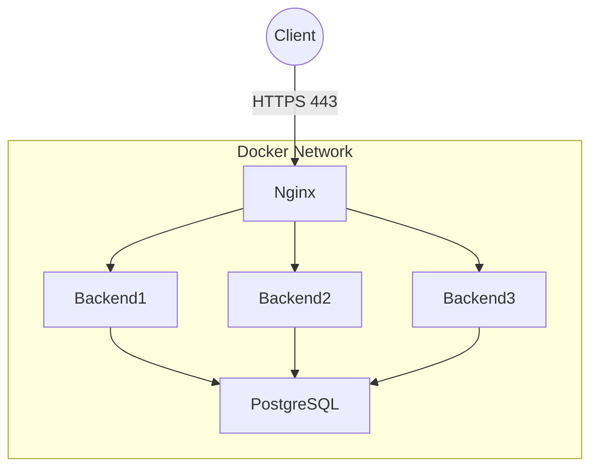
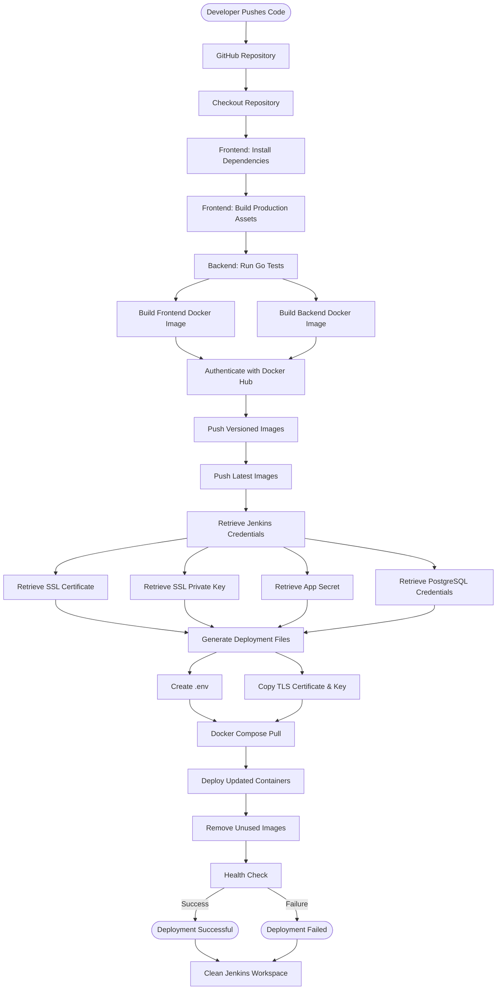
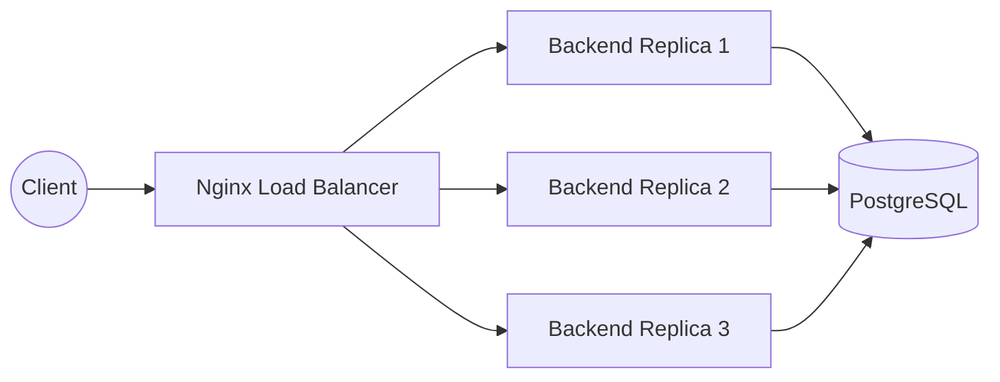

# Documentation

## Deployment Setup Approach

The frontend is built using a multi-stage Docker build. Static assets are served through Nginx. Nginx also acts as a reverse proxy for backend API requests.

The backend is containerized using a Go runtime image and communicates with PostgreSQL using environment variables supplied through Docker Compose.

PostgreSQL is deployed as a separate container with persistent storage provided through Docker volumes.

All these containers are linked by a same Docker Network

---

## Challenges Faced

During deployment, the machine already had a local PostgreSQL instance running on port 5432. As a result, Docker was unable to bind the PostgreSQL container to the same host port and produced a port allocation conflict.

To avoid this issue, the PostgreSQL container continued to listen on its default internal port:

`5432`

while being mapped to host port:

`5433`

---

Initially the backend could not connect to PostgreSQL because the connection string used:

`localhost:5432`

Inside containers, localhost refers to the container itself rather than another service.

The issue was resolved by using the Docker Compose service name:

`postgres://postgres:postgres@db:5432/cr45_reduced?sslmode=disable`

where db is the PostgreSQL service hostname

---

## Building and Running the Application
> Recommended OS - Any standard Linux distribution 
Please install docker if it doesn't exist in the system

### Directory 
`cd spider_devops_task1/DevOPS_Task1/`

### Generate SSL Certificates

`mkdir -p certs`

```
openssl req \
-x509 \
-newkey rsa:4096 \
-keyout certs/nginx_ssl.key \
-out certs/nginx_ssl.crt \
-days 365 \
-nodes
```

### Build and Start Containers
`docker compose up`

### Run in Detached Mode
`docker compose up -d`

### Stop Containers

`docker compose down`

### Remove Containers and Volumes
`docker compose down -v`

---

## Services and Ports

| Service  | Purpose                                   | Port                          |
|-----------|-------------------------------------------|-------------------------------|
| frontend | React application served through Nginx    | 80, 443(https)                       |
| backend  | Go API server                             | 8080                          |
| db       | PostgreSQL database                       | 5432 (container), 5433 (host) |

---

## How frontend reaches the backend

The frontend does not communicate directly with the backend container.
Here NGINX is the only entrypoint.

Instead, all API requests are sent to Nginx:

https://localhost/api/*

Nginx forwards those requests to:

http://backend:8080

using:
```
location /api/ {
    proxy_pass http://backend:8080;
}
```
Here nginx acts the reverse proxy.

---

## How PostgreSQL is configured
PostgreSQL runs in its own container.

Configuration is provided using environment variables in the docker compose file:

```
POSTGRES_DB=cr45_reduced

POSTGRES_USER=postgres

POSTGRES_PASSWORD=postgres
```

The backend connects using:

`postgres://postgres:postgres@db:5432/cr45_reduced?sslmode=disable`

Database persistence is achieved through a named Docker volume:

`postgres_data:/var/lib/postgresql/data`

This ensures data survives container recreation and restarts.

---

## Migration Handling

The backend automatically executes migrations during startup.

Migration files are stored in:

`backend/migrations/`

When the backend starts:

- Connects to PostgreSQL
- Executes pending migrations
- Creates required schema
- Seeds initial application data

---

## Common failure cases 

### SSL Certificates missing.

Certificate files are missing or not mounted.

Verify:

`ls certs`

and confirm these exists:

- nginx_ssl.crt
- nginx_ssl.key


If not there:

`mkdir -p certs`

```
openssl req \
-x509 \
-newkey rsa:4096 \
-keyout certs/nginx_ssl.key \
-out certs/nginx_ssl.crt \
-days 365 \
-nodes
```

---

## Improvements Implemented

### 1. Health checks

Health checks for the postgres db has been added to the docker compose file.

To verify it please run:

`docker ps` 

after starting the containers

---

### 2. Access and error logs

Added location for access and error logs by the nginx server 

To verify it run :

```
docker ps # get the hash id of frontend container
docker exec -it <hash_id_of_frontend_container> /bin/sh
cd /var/log/nginx/
ls
```

---

### 3 . Compression, Caching , keepalive tuning, worker/process tuning

Gzip Compression
```
gzip on;

gzip_vary on;
gzip_proxied any;
gzip_comp_level 6;

gzip_types
    text/css
    application/json
    application/javascript;
    
```

Static Asset Caching

```
location ~* \.(js|css)$ {
    expires 30d;
    add_header Cache-Control "public, immutable";
}
```
Keepalive Connections

```
keepalive_timeout 65;
keepalive_requests 100;
```

Worker Process Tuning

```
worker_processes auto;
worker_connections 1024;
```
Compression, caching headers for static assets, keepalive tuning,  worker/process tuning appropriate for the setup has been added to the nginx.conf file

Verify compression:

`curl -I -H "Accept-Encoding: gzip" https://localhost`

Expected header:Content-Encoding: gzip

Verify caching:
```
Open browser Developer Tools:

Network → Select JS/CSS file
```

Expected headers:

Cache-Control: public, immutable
Expires: <future date>

---

### 4. HTTPS support

The SSL / TLS certificates paths are provided to the nginx.conf to establish HTTPS connection between the client and the nginx server. 
```
Nginx HTTPS configuration:

listen 443 ssl;

Certificate configuration:

ssl_certificate /etc/nginx/certs/nginx_ssl.crt;
ssl_certificate_key /etc/nginx/certs/nginx_ssl.key;

TLS configuration:

ssl_protocols TLSv1.2 TLSv1.3;

HTTP traffic is automatically redirected:

server {
    listen 80;
    return 301 https://$host$request_uri;
}
```

Also redirection from HTTP to HTTPS is also implemeted using the HTTP status code 301

To verify this visit `http://localhost` 

# Task 2 Documentation

### Overview 
> This task aims upgrading the containerization to the production level. Implementing several security features. Built CI/CD pipelines, implemented horizontal scaling, analyzed performance using wrk and scanned the images using Trivy.

## System Architecture


## Reverse Proxy using Nginx

We have already implemented SSL/TLS termination using self signed certificates, compression using gzip. 

### Managed CORS headers 
```
add_header Access-Control-Allow-Origin "https://localhost" always;
            add_header Access-Control-Allow-Methods "GET, POST, PUT, DELETE, OPTIONS" always;
```
Allows web applications served from https://localhost to make cross-origin requests to the backend APIs 
### HSTS
HSTS stands for HTTP Strict Transport Security. Instructs the browser to use only HTTPS not HTTP anymore. Browser converts HTTP to HTTPS before a network connection

```
add_header Strict-Transport-Security "max-age=31536000; includeSubDomains" always;
```

added this line to server block in nginx

## CI/CD Pipelines 



## Production Optimization

- Removed hardcoded Environment variables from docker-compose file 
- Applied rate limiter to /api/
- Limited memory and cpu(s) for the docker service
- Setting Referrer Policy header as strict-origin-when-cross-origin
- Setting X-Content-Type-Options: nosniff
- Setting X-Frame-Options: DENY
- Permissions-Policy: geolocation=(), microphone=(), camera=()

## Horizontal Scaling 


1. Creating many instances for the backend using docker compose
2. Configured Load Balancing using nginx
```
upstream backend_pool {
    server backend1:9090 max_fails=3 fail_timeout=30s;
    server backend2:9090 max_fails=3 fail_timeout=30s;
    server backend3:9090 max_fails=3 fail_timeout=30s;
}
```
### Verification of requests across all Replicas

Please run the `DevOPS_Task1/verify_load_balancer.sh` bash script to verify multi replicas handling connections

### Fail Over Strategy
If one server goes down, another server automatically takes over so the application remains available.

Request 1: Fails. (Count = 1)

Request 2: Fails within 30 seconds of the first. (Count = 2)

Request 3: Fails within 30 seconds of the first. (Count = 3)

Server Down: NGINX stops sending new client requests to backend3 and waits for 30 seconds.

Cooldown: After 30 seconds, NGINX will send one probe request to check if the server is back online. If it succeeds, the server is returned to the rotation; if it fails, the 30-second cooldown resets

nginx detects backend instance has failed 
```
proxy_next_upstream error timeout invalid_header http_500 http_502 http_503 http_504;
proxy_next_upstream_tries 3;
```

`proxy_next_upstream` tells Nginx:

If the current backend fails for any of these reasons, automatically retry the request on another backend.
Reasons are specified like error, timeout, invalid_header, .. etc

### Screenshots of Load Balancing Wor


### After killing the Backend instance (1492db91ba60)


## Performance Testing 

Performance testing was conducted to evaluate the application's scalability, responsiveness, and resilience under concurrent client requests. The tests also compared the application's behavior before and after horizontal scaling, and verified that service availability was maintained during backend failures.

## Testing Tool

The application was benchmarked using **wrk**, a modern HTTP benchmarking tool capable of generating high volumes of concurrent requests.

Example command:

```bash
wrk -t4 -c100 -d30s https://localhost/healthz
```

| Parameter | Description |
|-----------|-------------|
| `-t4` | Uses 4 worker threads |
| `-c100` | Maintains 100 concurrent connections |
| `-d30s` | Runs the benchmark for 30 seconds |

## Benchmark Results

### Three Backend Replicas

| Metric | Result |
|---------|--------|
| Requests/sec | 6599.62 |
| Average Latency | 30.60 ms |
| Transfer Rate | 2.45 MB/s |
| Availability | 100% |

---

### Single Backend (Failover)

| Metric | Result |
|---------|--------|
| Requests/sec | 2773.82 |
| Average Latency | 55.63 ms |
| Transfer Rate | 1.17 MB/s |
| Availability | 100% |
---

## Performance Analysis

The benchmark results demonstrate that horizontal scaling significantly improved request throughput and reduced the processing load on individual backend instances. When two backend replicas were stopped, the application's throughput decreased as expected due to reduced processing capacity. However, the remaining backend continued serving requests successfully, confirming that the configured failover strategy maintained application availability.

[Performance Analysis Documentation](reports/performance_analysis_report.md)

---

## Conclusion

The performance evaluation verified that:

- Horizontal scaling increased application throughput.
- Nginx successfully balanced traffic across multiple backend replicas.
- The application remained available during backend failures.
- The configured failover strategy ensured uninterrupted service with graceful performance degradation under reduced backend capacity.

## Security Exploration

## Container Hardening

Docker containers run as the root user. If an attacker compromises the application, they would inherit root privileges inside the container, increasing the risk of privilege escalation and unauthorized system access.

### Implementation

A dedicated unprivileged user (appuser) was created inside the backend image, and the application was configured to run under this user instead of root.

```
RUN addgroup -S appgroup && adduser -S appuser -G appgroup
USER appuser
```
## Read-Only Container FileSystem

A writable filesystem allows attackers to modify application binaries, configuration files, or create malicious files if the container is compromised.

### Implementation

The backend container was configured with a read-only root filesystem using Docker Compose.
```
read_only: true
```

## Dropping Linux Capabilities

Linux capabilities divide root privileges into smaller permission sets. By default, containers receive several capabilities that may not be required by the application. Removing unnecessary capabilities reduces the attack surface.

```
cap_drop:
  - ALL
cap_add:
- NET_BIND_SERVICE
```

## 6.7 Vulnerability Scanning

### Tool Used

Container images were scanned using **Trivy**, an open-source vulnerability scanner that detects known vulnerabilities in operating system packages and application dependencies.

---

### Scan Procedure

The frontend and backend Docker images were scanned after the build process using:

```bash
trivy image risvanthkm/devops-task-frontend:latest

trivy image risvanthkm/devops-task-backend:latest
```

The scan analyzed:

- Operating system packages
- Go module dependencies
- Application libraries
- Known CVEs (Common Vulnerabilities and Exposures)

---

### Backend Scan Results

The initial backend scan reported vulnerabilities in Go module dependencies (Postgres Driver).

The affected dependencies were updated to their latest secure versions and the Docker image was rebuilt.

A follow-up Trivy scan confirmed that the backend image no longer contained the previously reported dependency vulnerabilities.

[Backend Image Scan Raw Output](reports/backend_image_report.md)

---

### Frontend Scan Results

The frontend image scan reported vulnerabilities in the Alpine Linux base image.

The majority of findings originated from system libraries such as:

- `libexpat`
- `c-ares`

These packages are maintained by the Alpine Linux distribution and are independent of the application code.
No Critical vulnerabilities were identified.

[Frontend Image Scan Raw Output](reports/frontend_image_report.txt)

---

### Applied Mitigations

The following security improvements were implemented:

- Updated vulnerable Go dependencies to secure versions.
- Rebuilt backend Docker images after dependency updates.
- Used the latest available Docker base images.
- Implemented multi-stage Docker builds to reduce the runtime attack surface.
- Configured containers to run as non-root users.
- Enabled read-only container filesystems where applicable.
- Restricted Linux capabilities using `cap_drop` and `cap_add`.
- Integrated Trivy scanning as part of the security validation process.

---

### Remaining Risks

The remaining vulnerabilities are associated with upstream Alpine Linux packages used by the frontend image.

These packages are maintained by the Alpine Linux maintainers and will be resolved by upgrading the base image once patched package versions become available.

No application-specific vulnerabilities were identified after updating backend dependencies.

---

## 6.8 Security Summary

| Security Measure | Status |
|------------------|:------:|
| Non-root Containers | ✅ |
| Read-only Filesystem | ✅ |
| Linux Capability Restrictions | ✅ |
| No Privilege Escalation | ✅ |
| HTTPS (TLS 1.2 & TLS 1.3) | ✅ |
| HTTP → HTTPS Redirection | ✅ |
| HSTS | ✅ |
| Security Headers | ✅ |
| Rate Limiting | ✅ |
| Secure Secret Management (Jenkins Credentials) | ✅ |
| Docker Image Vulnerability Scanning (Trivy) | ✅ |
| Go Dependency Updates | ✅ |
| Multi-stage Docker Builds | ✅ |
| Vulnerability Mitigation | ✅ |


# Thank You 

---
